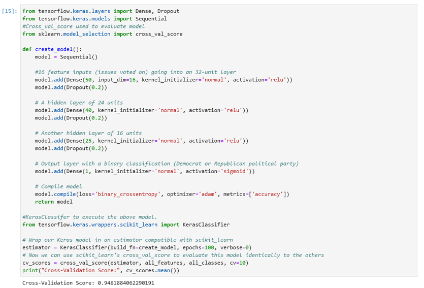
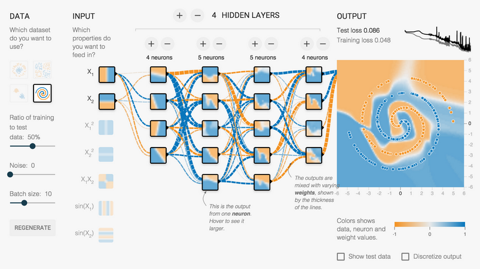

# TensorFlow: Predicting Political Party
## [Recurrent Neural Network using Python, TensorFlow & Keras]

 

I completed a machine-learning project to predict the political party of US Congress-members based on their voting record on 17-issues in the year 1984. Using the TensorFlow library and the keras API, we can predict the political party of a US congress-member with 95% accuracy. The project was kept small (232, 17) to limit computing expense; larger data sets would require the use of GPU’s and distributed training.

## Overview
### Dataset

### The Magic

### Model
Initially, I set Keras to use a Sequential model flow to allow for simple layer-building of four layers; Dense embedding layer (each neuron in the dense layer receives input from all neurons in the previous layer), Dropout (a filter applied to specific layers that prevents overfitting); relu (hidden layers) and sigmoid (last layer) activation functions, binary-crossentropy loss function, and the adam optimizer (final layer). I used the scikit-learn Python library to make cross-validation easier. 
**Below: Python Code for Model Layers and Settings:**

 

### Results
My experimentation with Keras settings improved the model’s accuracy from 94% to 95%.

### Additional Learning Topics

### About TensorFlow
TensorFlow is an open-source library for machine learning, specifically focused on training and inference of deep neural networks; it is perfectly aligned with working in the *Deep Learning* space.  Keras is an API built on top of Tensor Flow 2.0.  Keras minimizes the number of user-actions required for use cases and enables fast experimentation.  TensorFlow is often used to train neural networks (NN), to build recommender systems, and to train generative advesarial networs (GANNs).  TensorFlow can train and run deep neural networks for handwritten digit classification, image recognition, word embedding and creation of various sequence models. 
The base unit, the *Tensor* is a multi-dimensional array of data. In math, tensors are described as geometric objects that describe linear relationships between other geometric objects. More formally, Tensorflow is a symbolic math library based on dataflow and differentiable programming. 
TensorFlow Models are very *computationally expensive*, often requiring the use of a GPU or - even better than a GPU - a *tensor processing unit (TPU)*. Tensors are identified by the following three parameters: *Rank, Shape* and *Type*. 

Tensor flow is designed to function in two main deep neural networks:
1. Convolutional Neural Network, and
2. Recurrent Neural Network

**Keras & TensorFlow** 
Keras is compact, easy to learn, high-level Python library run on top of TensorFlow framework. It is made with focus of understanding deep learning techniques, such as creating layers for neural networks maintaining the concepts of shapes and mathematical details. 

**Tensor Flow Playground**
The best way to understand a Neural Network (and how TensorFlow operates on a NN) is throught *Visualization*.  The Neural Network Playground allows anyone to experiment with four datasets, and to create the entire NN model, then visually watch Tensor Flow converge on a solution. 
LINK HERE https://playground.tensorflow.org

 

